# Análisis de la industria del aguacate en México

En este repositorio se encuentran scripts y conjuntos de datos para analizar distintos aspectos de la industria del aguacate en México, incluyendo su producción, comercio exterior, importancia económica y precios al consumidor.

El proyecto busca ofrecer una perspectiva amplia de la industria mediante el análisis y visualización de datos, facilitando la exploración de sus principales características, tendencias y dinámicas a lo largo del tiempo.

# Conjuntos de datos

Los análisis presentados en este proyecto utilizan datos abiertos provenientes de distintas fuentes oficiales. Las bases fueron limpiadas y homologadas para mejorar su consistencia, facilitar su integración y hacerlas más eficientes y accesibles para su uso analítico.

* SIAP: Contiene información de la producción anual de diversos cultivos. (http://infosiap.siap.gob.mx/gobmx/datosAbiertos_a.php)

* INEGI (BCMM): Contiene información anual detallada de las exportaciones de México. (https://www.inegi.org.mx/programas/comext/#datos_abiertos)

* Secretaría de Economía (BCMM): Contiene información mensual detallada de las exportaciones de México. (https://www.economia.gob.mx/datamexico/es/vizbuilder)

* Banxico: Contiene información mensual simple de las exportaciones de México. (https://www.banxico.org.mx/SieInternet/consultarDirectorioInternetAction.do?sector=1&accion=consultarCuadro&idCuadro=CE37&locale=es)

* INEGI (PIBE): Contiene información detallada anual del PIB de México por entidad federativa. (https://www.inegi.org.mx/programas/pibent/2018/#datos_abiertos)

* PROFECO: Contiene los precios al consumidor desagregados por estado y comercio. (https://datos.profeco.gob.mx/datos_abiertos/qqp.php)

De todos estos conjuntos de datos solo se extrajo la información relevante al aguacate.

# Producción

Este bloque permite explorar la producción de aguacate en México desde su dimensión económica y productiva, a nivel nacional, estatal y municipal, incluyendo su participación, distribución geográfica y principales productores.

## Participación económica

Esta función dimensiona la importancia económica de la producción de aguacate comparando su valor de producción con distintos agregados económicos de referencia.

### Valor de la producción de aguacate vs. PIB nacional

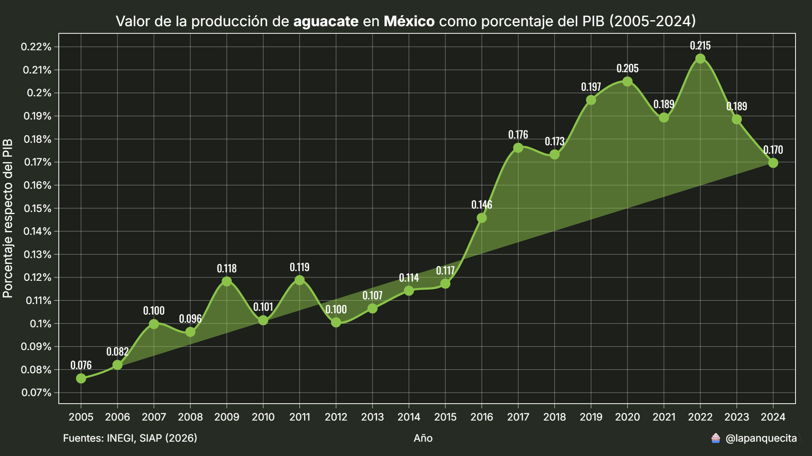

Esta comparación permite dimensionar el valor de la producción de aguacate frente al tamaño de la economía mexicana.

### El caso de Michoacán

Michoacán es la principal entidad productora de aguacate en México, por lo que resulta relevante analizar el peso de esta actividad dentro de su propia economía.

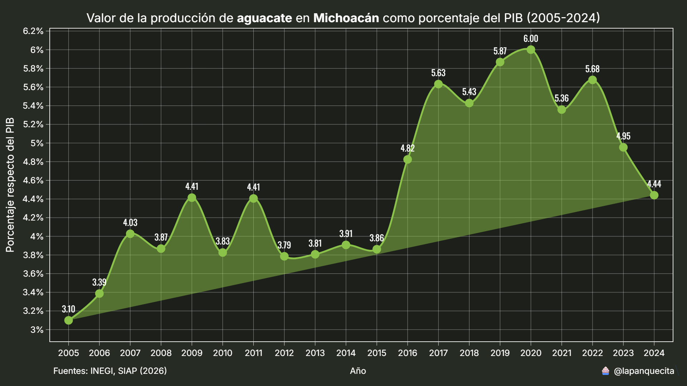

Posteriormente, el análisis se enfoca en el sector agrícola, comparando el valor de producción del aguacate con la actividad agrícola a nivel nacional y en Michoacán.

### Valor de la producción de aguacate vs. agricultura nacional

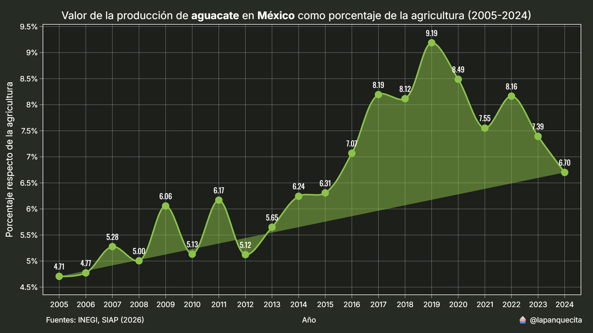

### Valor de la producción de aguacate vs. agricultura de Michoacán

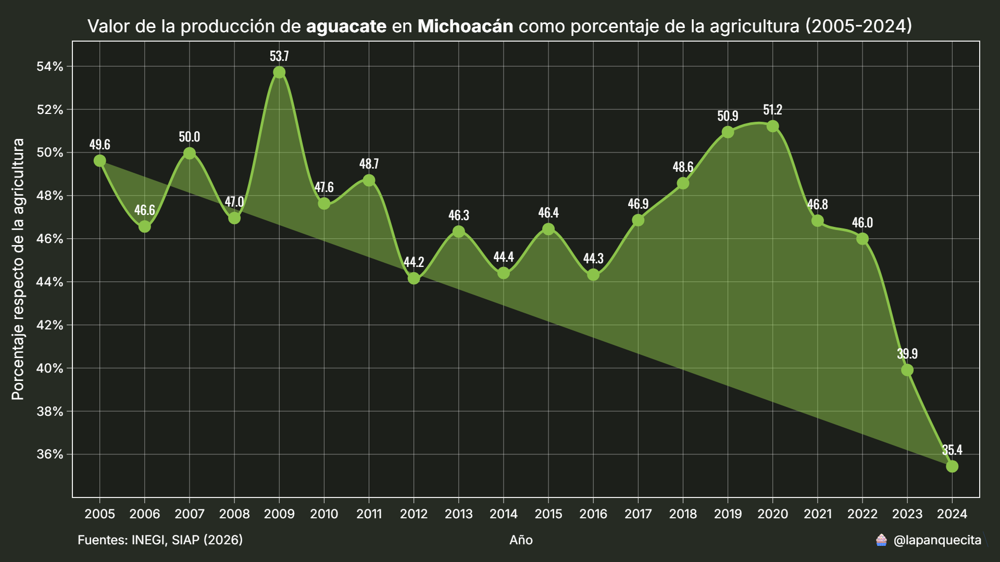

### Consideraciones sobre los datos

El PIB utilizado corresponde al PIB estatal y todas las comparaciones se realizan a precios corrientes. Por ello, se compara valor corriente contra valor corriente y no es necesario realizar un ajuste adicional por inflación.

Los porcentajes representan, por tanto, la participación del valor de la producción de aguacate respecto al agregado económico correspondiente en términos nominales.

## Participación en la producción

Esta función muestra la evolución de la participación de una entidad federativa específica dentro de la producción nacional de aguacate, permitiendo observar cómo ha cambiado su peso relativo a lo largo del tiempo.

### Michoacán

Michoacán ha mantenido el liderazgo en la producción nacional de aguacate, por lo que se analiza la evolución de su participación dentro del total producido en México.

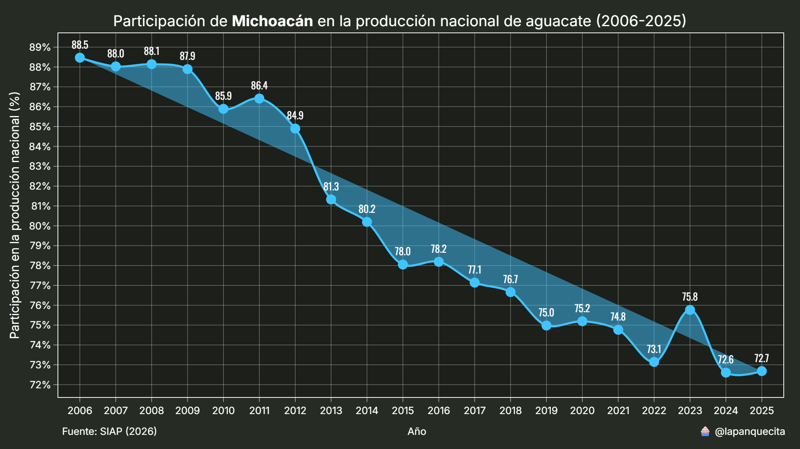

### Jalisco

Jalisco ha ocupado el segundo lugar en la producción nacional, por lo que se presenta su evolución y participación relativa frente al total nacional.

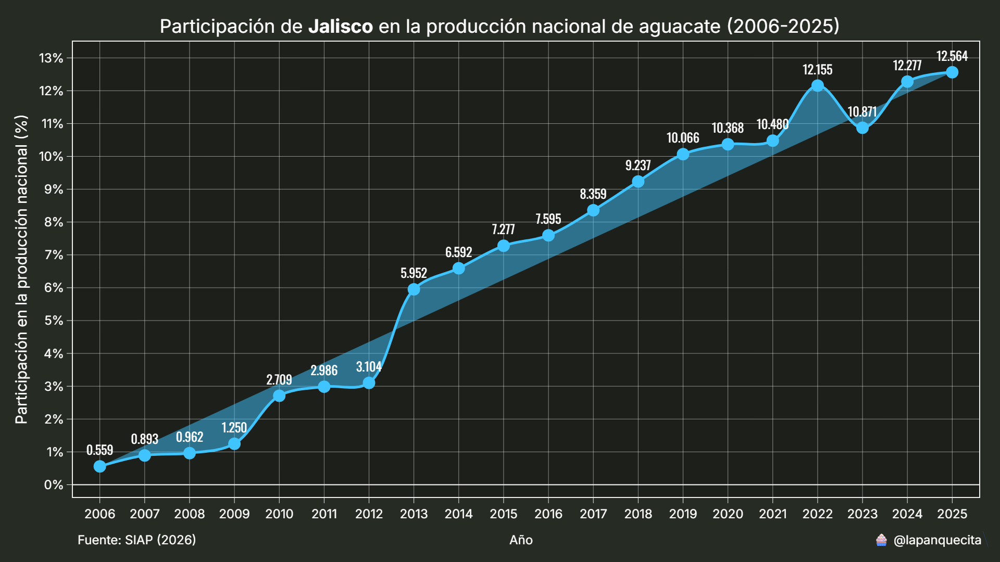

### Consideraciones sobre los datos

La participación se calcula utilizando como referencia el volumen de producción, expresado en toneladas. Esto permite comparar directamente la producción de cada entidad federativa con el volumen total nacional.

## Producción por entidad federativa

Esta función genera un mapa coroplético y una tabla con el desglose de la producción de aguacate por entidad federativa para un año determinado.

Debido a la amplia diferencia en los volúmenes de producción entre entidades, se utiliza una escala logarítmica para facilitar la visualización y comparación de los datos.

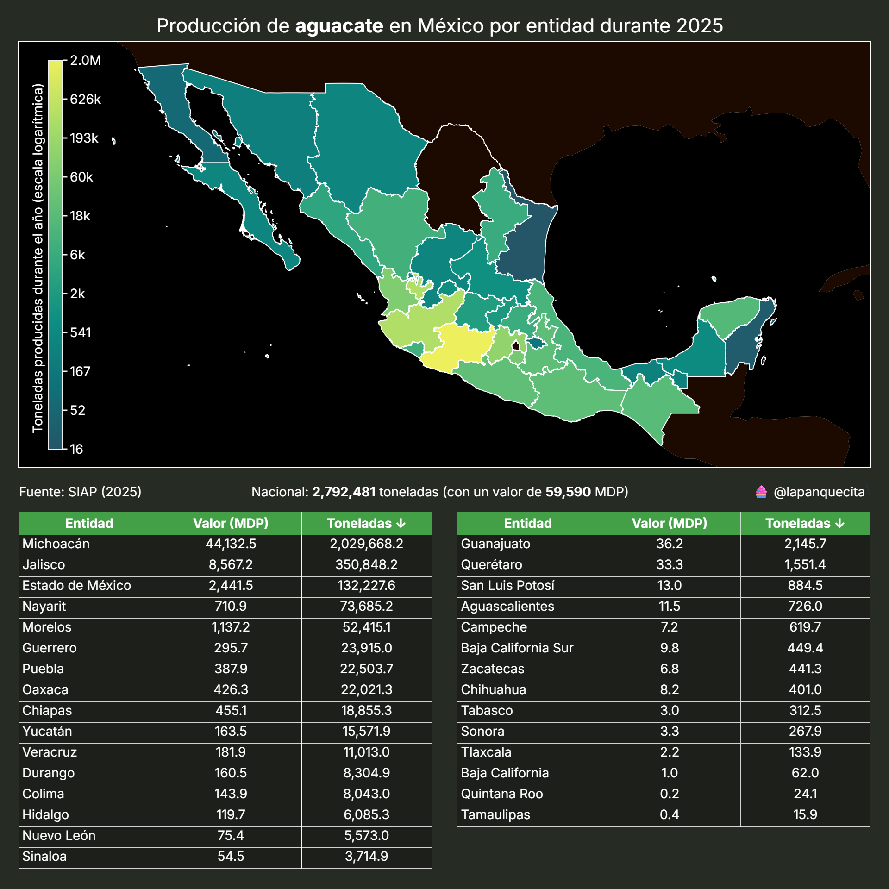

## Producción por municipio

Esta función genera un mapa coroplético que muestra la distribución de la producción de aguacate por municipio para un año determinado.

Debido a la amplia diferencia en los volúmenes de producción entre municipios, se utiliza una escala logarítmica para facilitar la visualización y comparación de los datos.

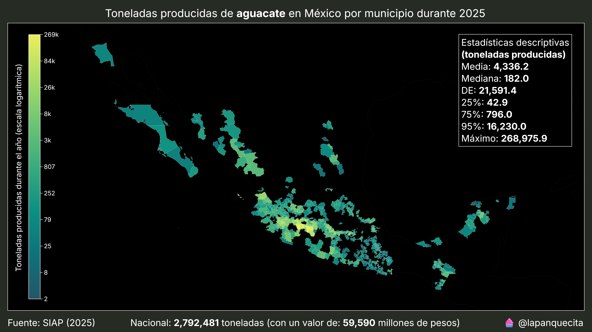

## Municipios con mayor producción

Esta función genera una tabla con los 30 municipios con mayor producción de aguacate para el año especificado.

La tabla presenta el volumen de producción en toneladas y la participación relativa de cada municipio respecto al total nacional.

# Comercio exterior

Este bloque permite analizar el comercio exterior del aguacate mexicano desde la perspectiva de sus destinos y mercados, considerando tanto el volumen como el valor de las exportaciones, así como la evolución de la producción destinada al mercado nacional y de exportación.

## Principales destinos de exportación por volumen

Esta función permite analizar los principales destinos de las exportaciones mexicanas de aguacate, utilizando información anual de la Balanza Comercial de Mercancías de México (BCMM) sobre el volumen y valor exportado por país o territorio de destino.

La disponibilidad de los datos puede variar entre periodos, ya que algunos registros pueden encontrarse incompletos o clasificados como confidenciales.

Debido a la amplia diferencia entre los volúmenes exportados, particularmente por el peso de Estados Unidos en las cifras, se utiliza una escala logarítmica para facilitar la visualización y comparación entre destinos.

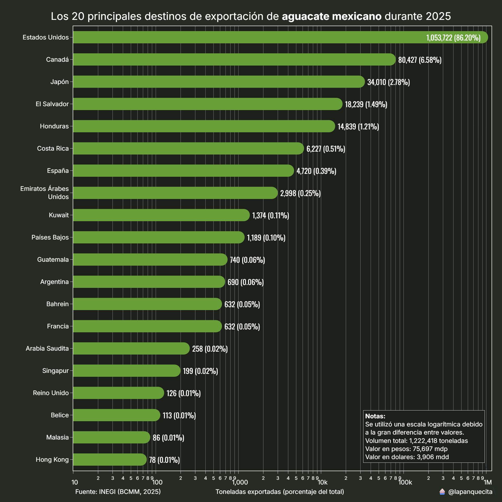

## Destinos de exportación por volumen

Esta función genera un mapa coroplético mundial que muestra la distribución del volumen de las exportaciones mexicanas de aguacate por país de destino para el año especificado, utilizando los datos disponibles de la Balanza Comercial de Mercancías de México (BCMM) del INEGI.

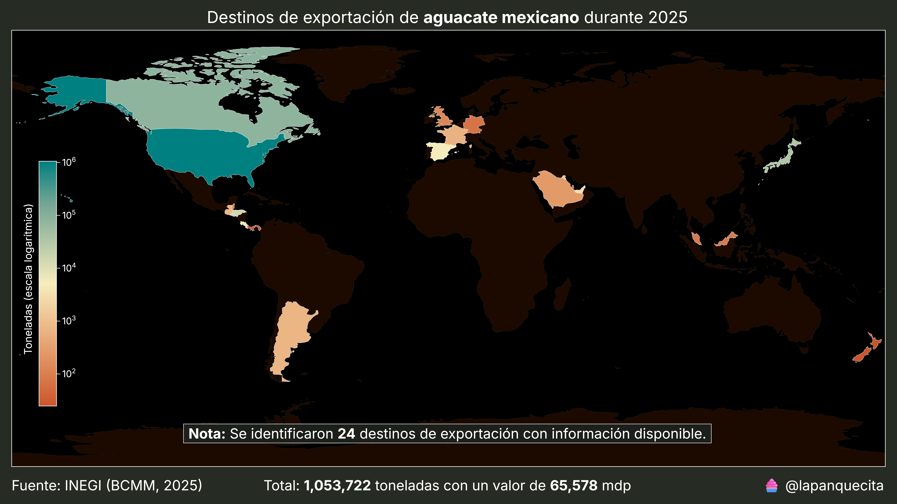

## Destinos de exportación por valor

Esta función genera un mapa coroplético mundial que muestra la distribución del valor de las exportaciones mexicanas de aguacate por país de destino para el año especificado, utilizando los datos disponibles de la Balanza Comercial de Mercancías de México (BCMM) de la Secretaría de Economía.

A diferencia de la fuente del INEGI, esta base únicamente contiene información sobre el valor de las exportaciones, pero permite identificar un mayor número de destinos al no presentar información confidencial.

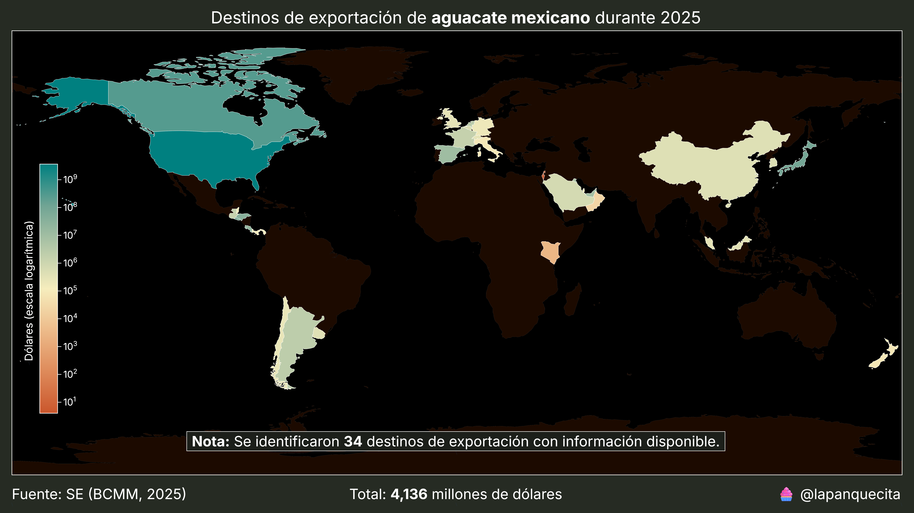

## Destino de la producción de aguacate

Esta función muestra la evolución de la producción de aguacate según su destino: mercado nacional y mercado de exportación.

El análisis utiliza como base la producción reportada por el SIAP y el volumen de exportación reportado por el INEGI, permitiendo observar cómo se distribuye la producción entre ambos mercados a lo largo del tiempo.

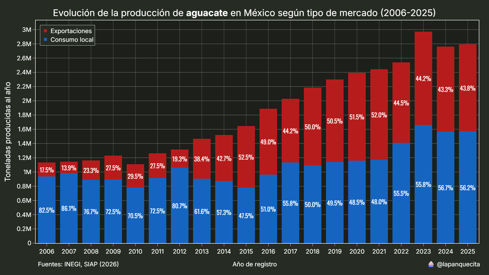

## Exportaciones mensuales por destino

Esta función muestra la evolución mensual del valor de las exportaciones de aguacate hacia un destino específico, permitiendo identificar tendencias y patrones estacionales.

El mes de febrero se resalta para cada año con el objetivo de facilitar la comparación entre periodos y analizar la hipótesis de un posible incremento de las exportaciones hacia Estados Unidos asociado al Super Bowl.

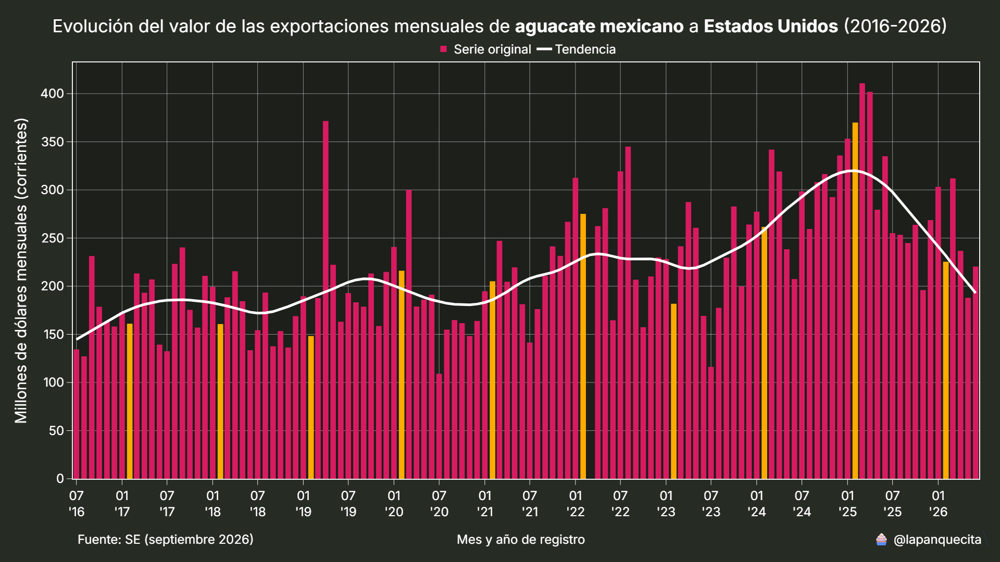

# Precios al consumidor

Este bloque permite analizar la evolución de los precios del aguacate desde la perspectiva del consumidor y su relación con el precio recibido por el productor. Incluye el comportamiento mensual y anual de los precios, así como la comparación entre precios rurales y al consumidor.

## Precio mensual de aguacate

Esta función genera una serie de boxplots que muestra la distribución mensual del precio al consumidor por kilogramo de aguacate para la entidad federativa especificada.

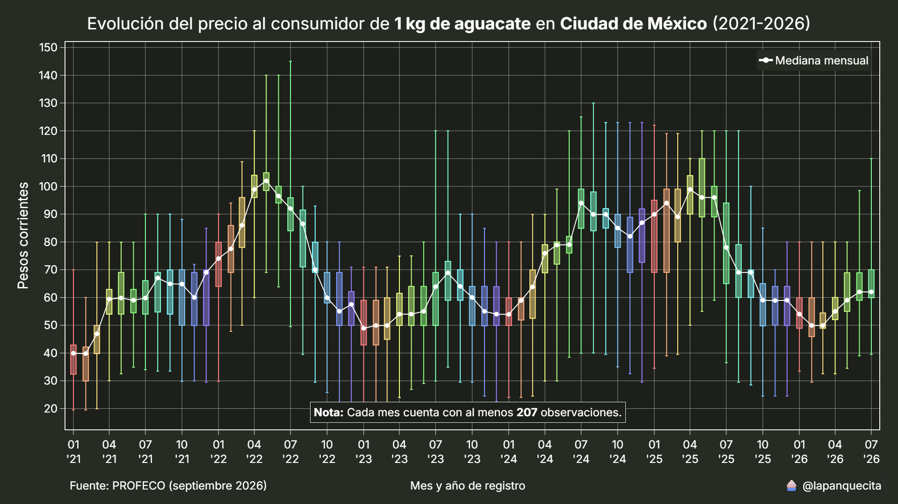

El análisis puede configurarse en dos modalidades: precios corrientes y precios constantes. Esto permite evaluar la estacionalidad de los precios y determinar si sus patrones se mantienen o cambian al considerar el efecto de la inflación.

Los precios provienen principalmente de tiendas de autoservicio (supermercados).

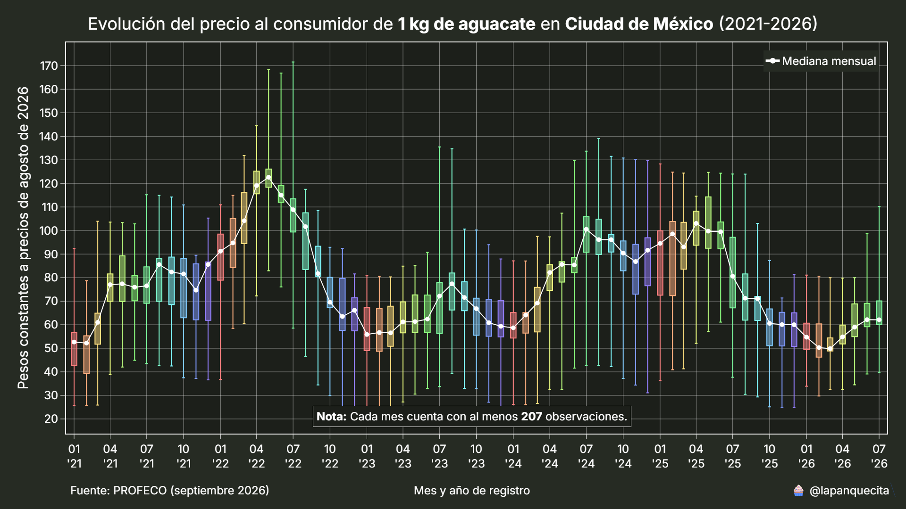

## Precio anual del aguacate

Esta función genera un ridgeplot que muestra la evolución anual del precio por kilogramo de aguacate para la entidad federativa y giro especificados.

Cada año incorpora información contextual sobre el número de observaciones, así como la media y mediana de los precios. Adicionalmente, se incluye una anotación que compara la inflación mediana con el incremento de la mediana del precio durante el mismo periodo, permitiendo evaluar la evolución relativa de ambos indicadores.

## Precio medio rural vs. precio al consumidor

Esta función genera una gráfica de barras comparativa que muestra el precio promedio anual recibido por el productor por kilogramo de aguacate frente al precio pagado por el consumidor por el mismo producto.

Adicionalmente, se incluye la razón entre el precio medio rural y el precio al consumidor, facilitando la comparación de ambos precios y su evolución a lo largo del tiempo.

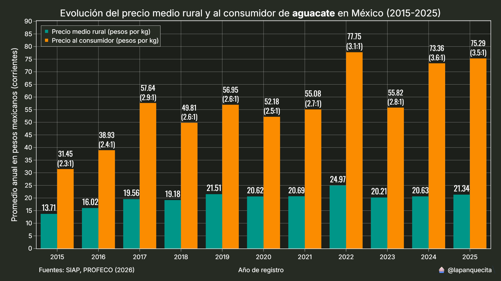

# Conclusión

Este proyecto ha evolucionado de manera gradual a lo largo del tiempo, incorporando nuevas fuentes de información, enfoques analíticos y tipos de visualización para explorar la industria del aguacate en México desde distintas perspectivas.

El desarrollo continúa abierto a nuevas mejoras. Con el tiempo se seguirán incorporando nuevas visualizaciones, análisis y herramientas que permitan ampliar y profundizar la exploración de los datos.
