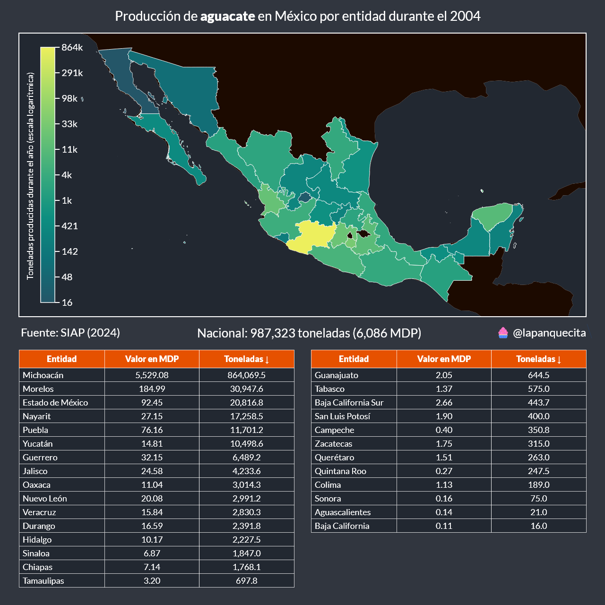
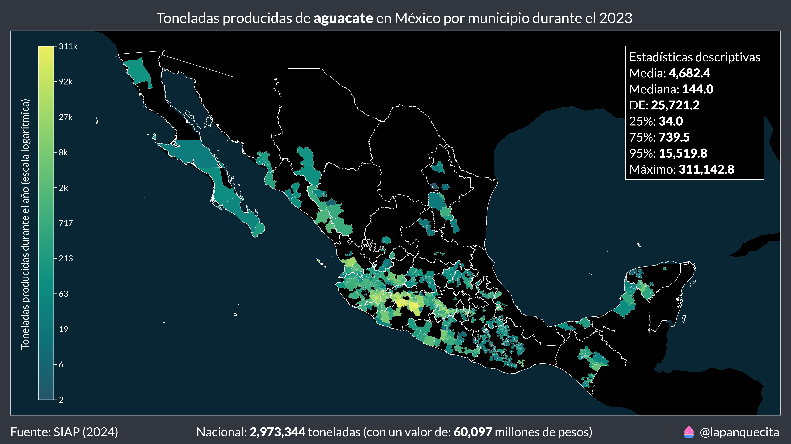
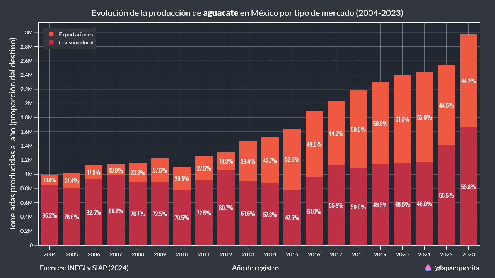

# Análisis de la industria del aguacate en México

En este repositorio se encuentran scripts y datasets que nos permiten analizar diferentes aspectos de la industria del aguacate en México, como su producción y exportación.

Se utilizaron distintas bases de datos abiertos:

* SIAP: Contiene información de la producción anual de diversos cultivos. (http://infosiap.siap.gob.mx/gobmx/datosAbiertos_a.php)

* INEGI (BCMM): Contiene información anual detallada de las exportaciones de México. (https://www.inegi.org.mx/programas/comext/#datos_abiertos)

* Banxico: Contiene información mensual simple de las exportaciones de México. (https://www.banxico.org.mx/SieInternet/consultarDirectorioInternetAction.do?sector=1&accion=consultarCuadro&idCuadro=CE37&locale=es)

* INEGI (PIB): Contiene información detallada trimestral del PIB de México. (https://www.inegi.org.mx/temas/pib/#tabulados)

* PROFECO: Contiene los precios al consumidor desagregados por estado y comercio. (https://datos.profeco.gob.mx/datos_abiertos/qqp.php)

De todas estas bases de datos solo se extrajo la información relevante al aguacate.

## Valor de la producción

El aguacate es considerao por muchos como "el oro vede de México". En la siguiente gráfica podremos conocer su valor respecto al Producto Interno Bruto.

Podemos notar que con el paso de los años, el valor del aguacate ha aumentado.

Un detalle importante de recordar es que el PIB está conformado por cientros de actividades económicas.

Veamos la misma gráfica pero ahora comparando solamente con la agricultura.

En 2019, 9 de cada 100 pesos que se produjeron de agricultura en México fueron exclusivamente de aguacate. Esto deja al resto del 91% para las miles de variedades de frutas, verduras, flores, forrrajes, semillas, granos, etc.

## Origen de la producción

Se dice que Michoacán es donde más se produce aguacate, y es verdad.

Durante el 2023, el estado de Michoacán fue responsable del 75.76% de toda la producción de aguacate en el país, lo que equivale a 3 de cada 4 aguacates.

Si crees que este porcentaje es alto, espera a ver el mapa del 2004.

En 2004, Michoacán fue responsable del 87.51% de la producción de aguacate en el país.

Al comparar ambos mapas, se puede observar que otras entidades también han entrado en esta lucraiva industria.

  >**Nota:** Para los mapas anteriores he utilizado una escala logarítmica para poder apreciar mejor la distribcuón.

 Los 10 municipios que más produjeron aguacate en 2023 fueron exclusivamente de Michoacán:

 | Municipio |   Toneldas | % Nacional |
|:------|--------------------:|-------:|
| Tacámbaro |          311,142.80 |  10.46 |
| Tancítaro |          303,620.00 |  10.21 |
| Salvador Escalante |          249,975.00 |   8.41 |
| Ario |          239,965.54 |   8.07 |
| Uruapan |          219,011.00 |   7.37 |
| Peribán |          158,513.00 |   5.33 |
| Nuevo Parangaricutiro |           94,582.00 |   3.18 |
| Los Reyes |           79,173.13 |   2.66 |
| Turicato |           72,442.90 |   2.44 |
| Tingüindín |           67,795.70 |   2.28 |

## Exportaciones

De acuerdo a las cifras del INEGI, durante el 2023 se exportaron 1.3 millones de toneladas de aguacate mexicano a 35 países y territorios.

El anterior gráfico se le conoce como un mapa binario, donde solo se muestran los países que recibieron aguacate, independientemente de la cantidad.

La cantidad de aguacate por país la concoeremos a continauación.

En 2023, Estados Unidos importó el 80% de todos los aguacates que México exportó.

Sin embargo, esto no fue siempre así, la distribución del 2004 está más equilibrada.

Cuando se acerca la fecha del Super Bowl es común escuchar la noticia de que México exporta mles de toneladas de aguacate a Estados Unidos para dicho evento. Esto da la idea de que las exportaciones tienen un pico en el mes de febrero.

La realidad es un tanto distinta.

Durante los últimos años, las exportaciones de aguacate no aumentan en febrero, de hecho disminuyen.

A principios del siglo, menos del 20% del aguacate que se producía en México se exportaba.

Esto ha cambiado gradualmente, al punto que en ocasiones la mitad del aguacate producido ya es exportado.

## Precio del aguacate

El precio del aguacate al consumidor final y el precio que recibe el productor no es el mismo.

De hecho la diferencia es bastante considerable.

Los consumidores suelen pagar el doble (o aveces el triple) de lo que reciben los productores por cada kilgramo de aguacate.

La gráfica anterior nos muestra que el precio del aguacate es suceptible a estacionalidad y que ha llegado a tener valores muy altos en estos últimos años.

## Conclusión

En este proyecto traté de analizar la mayor cantidad de aspectos posibles con la información libremente disponible.

Aún hay mucho máas que explorar y aprender. Esa es la razón por la cual he compartido todo el código fuente.

Espero que les hayan gustado las visualzaciones y les sirvan como ejemplo para sus futuros análisis.